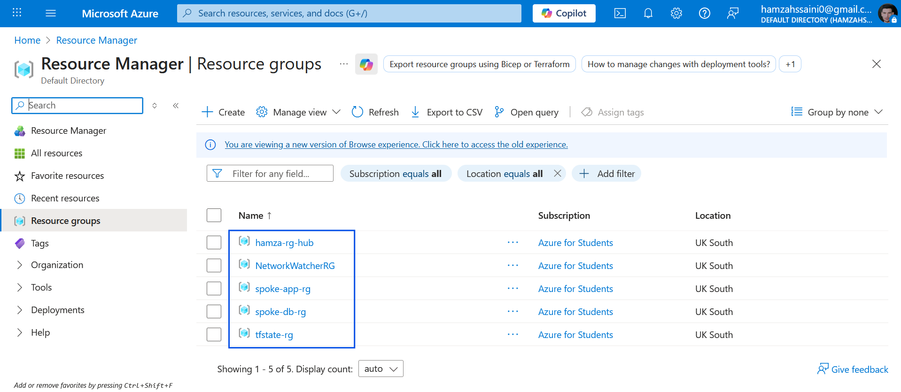

# Project Azure Hybrid Infra

Opinionated, production-ready Terraform repository for deploying a secure Azure hybrid infrastructure using a Hub-and-Spoke topology. This repo contains reusable modules, environment overlays, CI/CD pipeline examples (Azure DevOps), and screenshots/diagrams to document the design and deployment.

---

## Quick summary

- Topology: Hub (shared services) + Spokes (workloads/environments)  
- Hub services: Azure Firewall, Bastion, VPN/ExpressRoute gateway, NAT, logging/monitoring  
- IaC: Terraform (HCL) — modules for hub and spoke patterns  
- CI/CD: Azure DevOps pipeline examples included (`azure-pipelines.yml`, `azure-pipelines-1.yml`)  
- Remote state recommendation: `azurerm` backend using an Azure Storage Account

---

## Repository layout

```
.
├── .terraform/                     — local plugin/cache (do NOT commit)
├── images/                         — diagrams & screenshots (place screenshots here)
├── modules/
│   ├── hub/
│   │   ├── main.tf
│   │   ├── outputs.tf
│   │   └── variables.tf
│   └── spoke/
│       ├── main.tf
│       ├── outputs.tf
│       └── variables.tf
├── .gitignore
├── .terraform.lock.hcl
├── azure-pipelines.yml             — pipeline example (plan/apply pattern)
├── azure-pipelines-1.yml           — alternate CI/CD example
├── backend.tf                      — backend configuration template
├── main.tf                         — root orchestration (calls modules)
├── outputs.tf                      — root outputs
├── providers.tf                    — provider configuration
├── README.md                       — this file
├── terraform.tfstate               — (should be remote; remove from repo!)
├── terraform.tfstate.backup
└── variables.tf                     — root variables
```
---

## Design & module responsibilities

- modules/hub
  - Responsible for provisioning shared infrastructure: central VNet, Azure Firewall, Bastion Host, VPN/ExpressRoute gateway, Log Analytics, Key Vault (if required), NAT, and any hub-level RBAC.
  - Exposes outputs for VNet id, firewall IPs, bastion id, gateway id, log analytics IDs.

- modules/spoke
  - Responsible for workload VNets, subnet design, NSGs, and peering to Hub.
  - Exposes outputs for spoke VNet id, subnet ids, and peering resource ids.

Make modules small, idempotent, and parameterized for reuse across environments.

---

## Prerequisites

- Terraform 1.4+ (tested)
- Azure CLI (`az`) 2.30+
- An Azure subscription and permission to create resource groups, storage accounts, service principals
- (Recommended) Service Principal or Managed Identity for automation in CI/CD

---

## Remote state (strongly recommended)

Use an Azure Storage backend — one storage account/container per environment is recommended.

Example backend configuration (backend.tf):
```hcl
terraform {
  backend "azurerm" {
    resource_group_name  = "rg-tfstate"
    storage_account_name = "stterraformstate"
    container_name       = "tfstate"
    key                  = "envs/dev.terraform.tfstate"
  }
}
```

Bootstrap the backend storage account and container before `terraform init` when using the backend.

Security best-practices:
- Restrict storage account access with RBAC/firewall.
- Use a managed identity or a least-privilege service principal for CI.

---

## Quickstart (local)

1. Clone the repo:
```bash
git clone https://github.com/<owner>/Project-Azure-Hybrid-Infra.git
cd Project-Azure-Hybrid-Infra
```

2. Remove local state from repo (if present) and configure backend:
```bash
git rm --cached terraform.tfstate terraform.tfstate.backup
git commit -m "Remove local Terraform state"
```

3. Authenticate:
```bash
az login
az account set --subscription "<YOUR_SUBSCRIPTION_ID_OR_NAME>"
```

4. Initialize and apply (example: dev env):
```bash
# configure backend.tf for dev or copy backend template
cd envs/dev || mkdir -p envs/dev && cd envs/dev
terraform init
terraform plan -var-file="terraform.tfvars"
terraform apply -var-file="terraform.tfvars" -auto-approve
```

Always review `terraform plan` before applying, and prefer non-interactive automation for CI/CD.

---

## CI/CD (Azure DevOps)

Two pipeline examples are included: `azure-pipelines.yml` and `azure-pipelines-1.yml`. Typical pattern:

- Validate: `terraform fmt -check` and `terraform validate`
- Plan: `terraform plan` stored as an artifact for review
- Apply: `terraform apply` from a protected branch with required approvals

Store secrets in Azure DevOps variable groups or reference Key Vault via service connection. Use pipeline approvals for production `apply`.

Example snippet (concept):
```yaml
stages:
  - stage: Validate
  - stage: Plan
  - stage: Apply # guarded by approvals
```

Refer to the included YAML files for concrete steps and environment variables used in this repo.

---

## Variables & recommended layouts

- Keep environment-specific values in `envs/<env>/terraform.tfvars`.
- Keep sensitive values in Key Vault and pass via CI secret injection.
- Example variable files:
  - `variables.tf` (root/module) — declares inputs and sensible defaults
  - `terraform.tfvars` (env) — override values per environment

---

## Testing, validation & security scanning

Recommended CI checks:
- terraform fmt -check
- terraform validate
- tflint
- checkov or terrascan for security policy checks
- unit/integration tests for modules (terratest) where applicable

---

## Screenshots & diagrams

Add the architecture diagrams and screenshots to the `images/` folder. Recommended filenames (place these exact names in `images/`):

- `Arch.png` — architecture diagram of the project
- `ci-cd.png` — Azure DevOps pipeline screenshot
- `rgall.png` — resource groups created in Azure (success)
- `hub-ressources.png` — Hub resources (Firewall, Bastion, Gateway)

Markdown to include these images in this README (copy/paste where you want them displayed):

<p align="center">
  
  <br><em>Figure 1.</em> Project architecture (Hub-and-Spoke).
</p>

<p align="center">
  
  <br><em>Figure 2.</em> CI/CD — Azure DevOps pipelines (plan/apply).
</p>

<p align="center">
  
  <br><em>Figure 3.</em> Resource groups created in Azure.
</p>

<p align="center">
  
  <br><em>Figure 4.</em> Hub resources — Firewall, Bastion, VPN/ExpressRoute Gateway.
</p>

How to add images and commit:
```bash
mkdir -p images
# copy Arch.png ci-cd.png rgall.png hub-ressources.png into images/
git add images/Arch.png images/ci-cd.png images/rgall.png images/hub-ressources.png
git commit -m "Add architecture diagrams and pipeline screenshots"
git push
```

If you prefer, edit this README on GitHub and drag-and-drop images into the editor — GitHub will upload and insert relative links automatically.

---

## Cleanup

To destroy resources created for testing:
```bash
cd envs/dev
terraform destroy -var-file="terraform.tfvars" -auto-approve
```

Also clean up remote state objects (storage container keys) if you created them only for tests.

---

## Security & operational recommendations

- Centralize logs in Log Analytics in the Hub and enable diagnostic settings on Firewall/Gateway.
- Use managed identities where possible and Key Vault for secrets.
- Implement RBAC least-privilege for automation accounts/service principals.
- Tag resources for cost allocation and governance.

---

## Contributing

1. Create an issue describing the change.
2. Branch: `git checkout -b feat/<short-description>`.
3. Add tests/examples for module changes.
4. Open a PR with description and testing steps.

Please run `terraform fmt` and add/update module-level examples for any changes to modules.

---

## License & contact

Add a license if you plan to accept external contributions (e.g., MIT, Apache-2.0). This repository currently has no license.

Maintainer: hamzahssaini

---